# Apache Kafka Projects

This repository contains two Apache Kafka projects developed using Python and Docker to demonstrate real-time event streaming, consumer groups, partition rebalancing, and event-driven processing.

## Technologies Used

* Apache Kafka
* Python
* kafka-python
* Docker

---

# Project 1: E-Commerce Event Processing

A Kafka-based order processing system demonstrating core Kafka concepts.

### Features

* Producer & Consumer
* Consumer Groups
* Partition Rebalancing
* Poison Message Handling

### Topic

```text
ecommerce.orders
```

### Workflow

```text
orders.csv
    ↓
Producer
    ↓
ecommerce.orders
    ↓
Consumers
```

### Screenshots

#### Topic Description

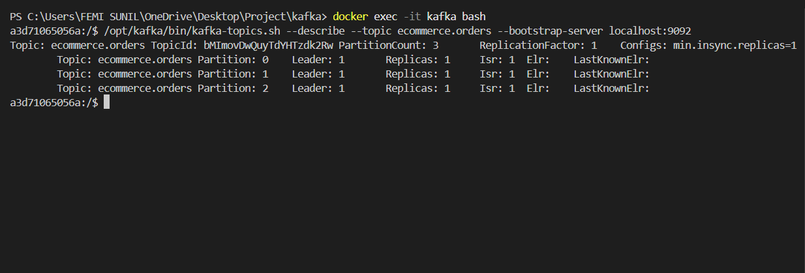

#### Producer Output

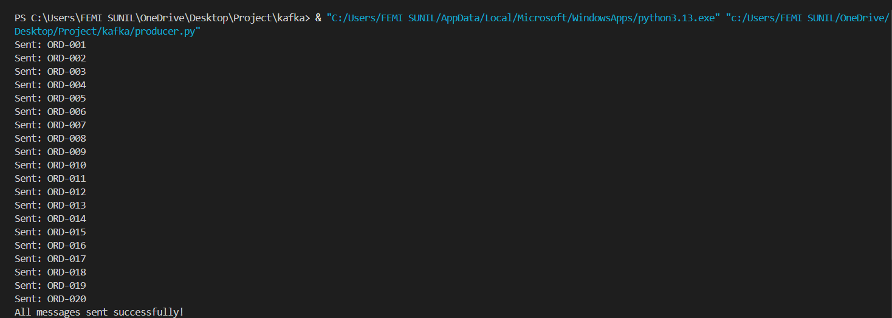

#### Consumer Output

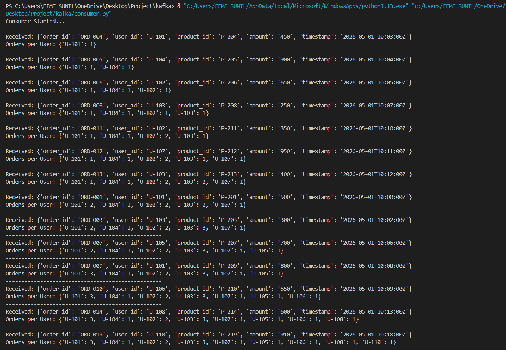

#### Partition Rebalancing

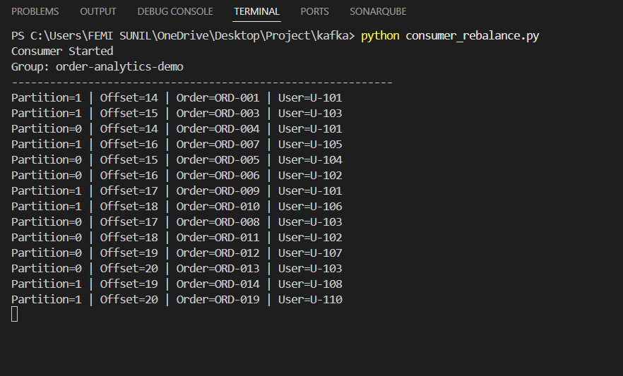

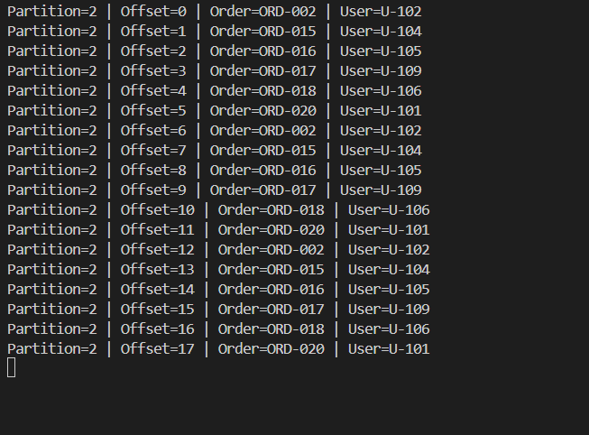

#### Poison Message Handling

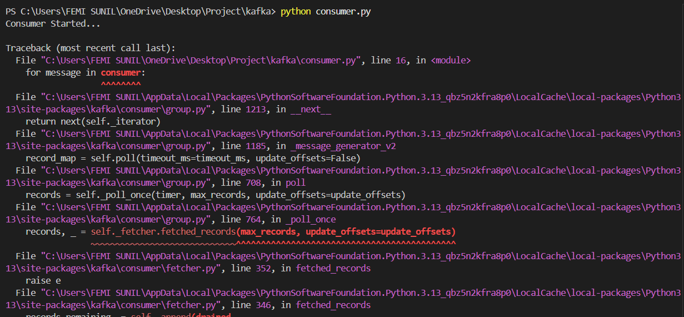

---

# Project 2: Ride Sharing Event Pipeline

A Kafka-based ride sharing system that processes ride events and generates driver analytics.

### Features

* Ride Event Producer
* Completed Ride Filtering
* Driver Earnings Calculation
* Top Drivers Reporting

### Topics

```text
ride.events
ride.completed
driver.earnings
```

### Architecture

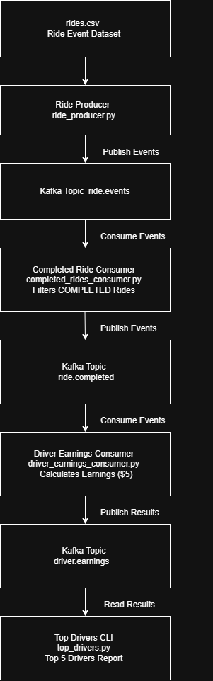

### Workflow

```text
rides.csv
    ↓
Ride Producer
    ↓
ride.events
    ↓
Completed Ride Consumer
    ↓
ride.completed
    ↓
Driver Earnings Consumer
    ↓
driver.earnings
    ↓
Top Drivers CLI
```

### Screenshots

#### Ride Producer

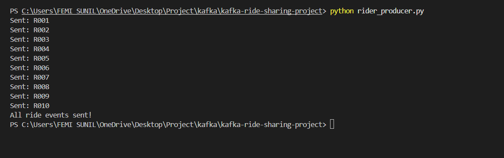

#### Completed Ride Consumer

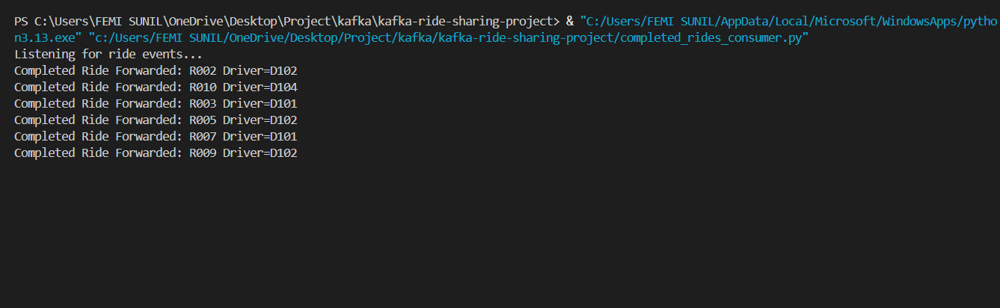

#### Driver Earnings

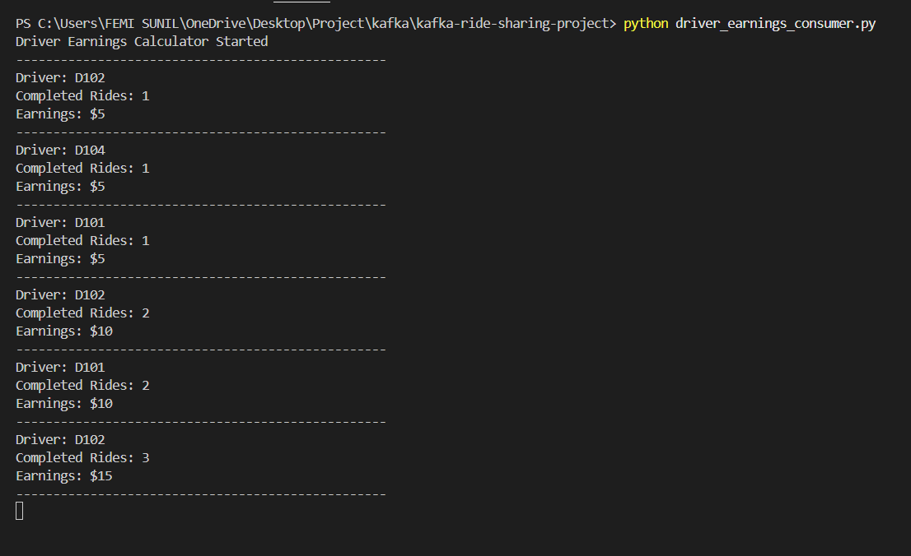

#### Top Drivers

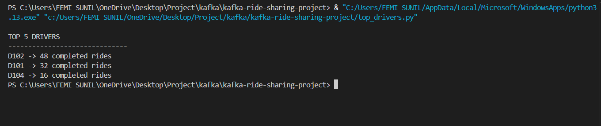

---

# Learning Outcomes

* Kafka Producers & Consumers
* Kafka Topics & Partitions
* Consumer Groups
* Partition Rebalancing
* Event Filtering
* Event-Driven Architecture
* Real-Time Data Processing

---

# Author

**Femi Sunil**
